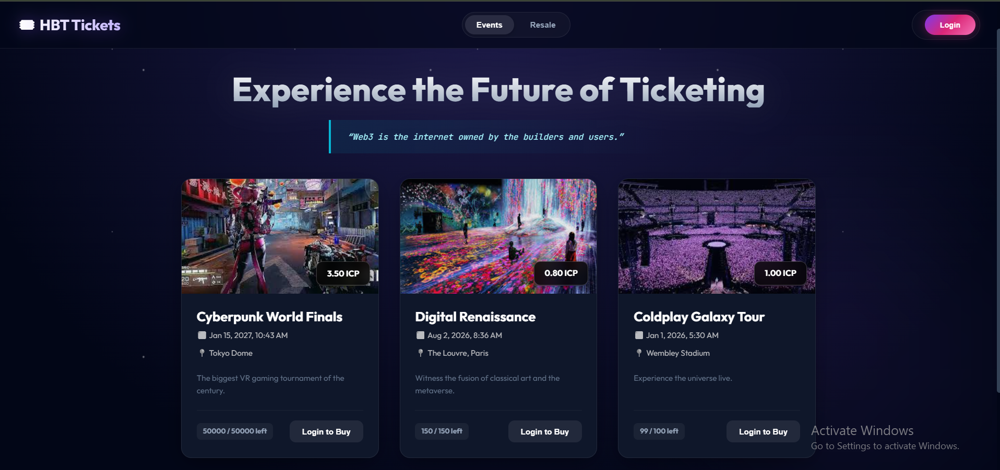

# 🌌 HBT  Ticketing System

> A next-generation decentralized event ticketing platform built on the **Internet Computer (ICP)**, featuring a "Galaxy" aesthetic and anti-scalping mechanisms.



##  Overview

The **HBT Ticketing System** solves the problem of ticket scalping and counterfeit tickets in the event industry. By issuing tickets as **Non-Fungible Tokens (NFTs)** on the Internet Computer blockchain, we ensure:

1.  **Authenticity:** Every ticket is cryptographically verifiable.
2.  **Controlled Resale:** A secondary marketplace where price gauging is mathematically impossible (capped at 1.2x original price).
3.  **Ownership:** Users truly own their assets via Internet Identity.

The project features a custom **"Nebula/Galaxy" Design System** built from scratch using SCSS, offering a modern, glassmorphic user experience.

---

##  Key Features

### Blockchain Security
* **Smart Contract Backend:** Written in **Motoko**, handling all logic for minting, transfers, and marketplace listings.
* **Mock Authentication:** Integrated local development authentication simulating Internet Identity (Principal ID: `2vxsx-fae`).

###  Galaxy UI / UX
* **Nebula Theme:** Custom CSS animations (`starFloat`), neon gradients, and dark-mode aesthetics.
* **Glassmorphism:** Translucent cards and modals for a futuristic feel.
* **Responsive Grid:** Adapts seamlessly to different screen sizes.

###  Ticketing Logic
* **Event Creation:** Admins can create events with specific supplies, prices (in e8s), and dates.
* **Purchase Flow:** Atomic transactions deduct balance and mint a ticket NFT to the user's wallet.
* **Resale Market:**
    * Users can list valid tickets for resale.
    * **Smart Cap:** The contract rejects any listing price higher than 120% of the original face value.

### Local Asset Management
* Hybrid architecture serving assets directly from the canister to avoid Content Security Policy (CSP) errors.
* Support for high-res event banners hosted on-chain.

---

## Technology Stack

| Component | Technology | Description |
| :--- | :--- | :--- |
| **Blockchain** | Internet Computer (ICP) | The underlying decentralized network. |
| **Backend** | Motoko | Actor-based smart contract language. |
| **Frontend** | React + Vite | High-performance UI framework. |
| **Styling** | SCSS / Sass | Custom styling (No Tailwind/Bootstrap). |
| **Auth** | Internet Identity | Cryptographic authentication (Mocked locally). |
| **Tools** | DFX SDK | CLI for deploying and managing canisters. |

---

##  Installation & Local Setup

Follow these steps to set up the environment.

### 1. Prerequisites
* **Node.js:** v18.0.0 or higher.
* **DFX SDK:** Latest version (`sh -ci "$(curl -fsSL https://internetcomputer.org/install.sh)"`).
* **Git**

### 2. Clone and Install
```bash
git clone <https://github.com/Sarvesha91/HBT_Ticketing_System>
cd HBT_ticketing_system
```
### Install dependencies
### IMPORTANT: This installs @dfinity/agent v1.4.0 to ensure local API compatibility.
npm install

- [Quick Start](https://internetcomputer.org/docs/current/developer-docs/setup/deploy-locally)
- [SDK Developer Tools](https://internetcomputer.org/docs/current/developer-docs/setup/install)
- [Motoko Programming Language Guide](https://internetcomputer.org/docs/current/motoko/main/motoko)
- [Motoko Language Quick Reference](https://internetcomputer.org/docs/current/motoko/main/language-manual)

If you want to start working on your project right away, you might want to try the following commands:

```bash
cd HBT_ticketing_system/
dfx help
dfx canister --help
```

## Running the project locally

If you want to test your project locally, you can use the following commands:

```bash
# Starts the replica, running in the background
dfx start --background

# Deploys your canisters to the replica and generates your candid interface
dfx deploy
```

Once the job completes, your application will be available at `http://localhost:4943?canisterId={asset_canister_id}`.

If you have made changes to your backend canister, you can generate a new candid interface with

```bash
npm run generate
```

at any time. This is recommended before starting the frontend development server, and will be run automatically any time you run `dfx deploy`.

If you are making frontend changes, you can start a development server with

```bash
npm start
```

Which will start a server at `http://localhost:8080`, proxying API requests to the replica at port 4943.

### Note on frontend environment variables

If you are hosting frontend code somewhere without using DFX, you may need to make one of the following adjustments to ensure your project does not fetch the root key in production:

- set`DFX_NETWORK` to `ic` if you are using Webpack
- use your own preferred method to replace `process.env.DFX_NETWORK` in the autogenerated declarations
  - Setting `canisters -> {asset_canister_id} -> declarations -> env_override to a string` in `dfx.json` will replace `process.env.DFX_NETWORK` with the string in the autogenerated declarations
- Write your own `createActor` constructor

